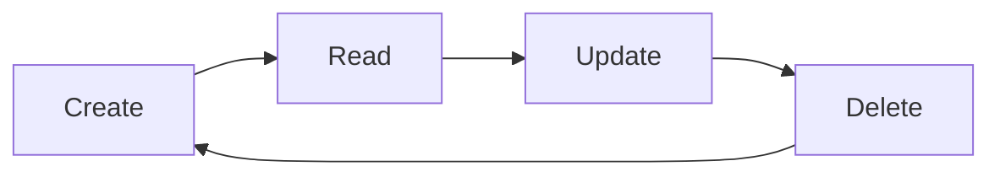

<!--
SPDX-License-Identifier: MPL-2.0
Copyright (c) Jonathan D.A. Jewell <j.d.a.jewell@open.ac.uk>
-->
# BoJ Server Resources

## Knowledge Graph

### Entities
Contextual data about people, projects, organizations, and tools.

**Fields**:
- `id`: Unique identifier
- `name`: Entity name
- `type`: Entity type (person, project, organization, tool)
- `created_at`: Creation timestamp
- `updated_at`: Last update timestamp

**Example**:
```json
{
  "id": "ent_123",
  "name": "BoJ Server",
  "type": "project",
  "created_at": "2026-01-01T00:00:00Z",
  "updated_at": "2026-05-28T00:00:00Z"
}
```

### Observations
Factual statements about entities with temporal validity.

**Fields**:
- `id`: Unique identifier
- `entity_id`: Reference to entity
- `content`: The factual statement
- `source`: Source of the information
- `valid_from`: Start of validity period
- `valid_to`: End of validity period (null if current)
- `confidence`: Confidence score (0-1)

**Example**:
```json
{
  "id": "obs_456",
  "entity_id": "ent_123",
  "content": "BoJ Server supports 125 cartridges",
  "source": "documentation",
  "valid_from": "2026-01-01T00:00:00Z",
  "valid_to": null,
  "confidence": 1.0
}
```

### Relations
Typed relationships between entities.

**Fields**:
- `id`: Unique identifier
- `from_entity_id`: Source entity
- `to_entity_id`: Target entity
- `type`: Relation type (e.g., "depends_on", "uses", "created_by")
- `weight`: Relation strength (0-1)
- `created_at`: Creation timestamp

**Example**:
```json
{
  "id": "rel_789",
  "from_entity_id": "ent_123",
  "to_entity_id": "ent_456",
  "type": "depends_on",
  "weight": 0.9,
  "created_at": "2026-01-01T00:00:00Z"
}
```

## Sessions

### Session State
Persistent session information.

**Fields**:
- `id`: Session ID
- `project`: Associated project (optional)
- `started_at`: Session start time
- `ended_at`: Session end time (null if active)
- `summary`: Session summary
- `context": Array of previous session summaries

**Example**:
```json
{
  "id": "sess_123",
  "project": "boj-server",
  "started_at": "2026-05-28T10:00:00Z",
  "ended_at": "2026-05-28T11:30:00Z",
  "summary": "Added 5 new cartridges and updated documentation",
  "context": [
    "2026-05-27: Created coderag-mcp cartridge",
    "2026-05-26: Updated integration tests"
  ]
}
```

## Learnings

### Learning Categories

**Pattern**: Recurring successful approaches
**Mistake**: What went wrong and how to avoid
**Insight**: Strategic realizations
**Research**: External knowledge
**Architecture**: System design decisions
**Infrastructure**: Deployment and scaling
**Tool**: Tool-specific knowledge
**Workflow**: Process improvements
**Performance**: Optimization techniques
**Security**: Security best practices

### Learning Structure

**Fields**:
- `id`: Unique identifier
- `category`: Learning category
- `content`: The knowledge
- `tags`: Array of tags
- `confidence`: Confidence score (0-1)
- `project`: Associated project (optional)
- `created_at`: Creation timestamp
- `updated_at`: Last update timestamp

**Example**:
```json
{
  "id": "learn_123",
  "category": "pattern",
  "content": "Use Zig for performance-critical FFI layers",
  "tags": ["performance", "zig", "ffi"],
  "confidence": 0.9,
  "project": "boj-server",
  "created_at": "2026-01-01T00:00:00Z",
  "updated_at": "2026-05-28T00:00:00Z"
}
```

## Decisions

### Decision Structure

**Fields**:
- `id`: Unique identifier
- `title`: What was decided
- `decision`: The choice made
- `reasoning`: Why this decision was made
- `alternatives`: What else was considered
- `confidence`: Confidence score (0-1)
- `project`: Associated project (optional)
- `created_at`: Creation timestamp

**Example**:
```json
{
  "id": "dec_456",
  "title": "Choose Zig for FFI",
  "decision": "Use Zig for all FFI layers",
  "reasoning": "Zig provides better performance and memory safety than C",
  "alternatives": "C, Rust, C++",
  "confidence": 0.95,
  "project": "boj-server",
  "created_at": "2026-01-01T00:00:00Z"
}
```

## Cartridges

### Cartridge Metadata

**Fields**:
- `name`: Cartridge name
- `version`: Semantic version
- `description`: Cartridge description
- `domain`: Domain (e.g., Database, Git, Cloud)
- `tier`: Tier (Teranga, Shield, Ayo)
- `protocols`: Supported protocols (MCP, REST, GraphQL, gRPC)
- `auth`: Authentication requirements
- `ports`: Allowed/denied ports
- `tools`: Array of tool definitions

**Example**:
```json
{
  "name": "database-mcp",
  "version": "0.1.0",
  "description": "Universal database gateway",
  "domain": "Database",
  "tier": "Ayo",
  "protocols": ["MCP", "REST"],
  "auth": {
    "method": "none"
  },
  "ports": {
    "allowed": [5432, 3306, 27017],
    "denied": [22, 23, 25]
  },
  "tools": [
    {
      "name": "database_connect",
      "description": "Connect to a database backend"
    }
  ]
}
```

## Projects

### Project Structure

**Fields**:
- `id`: Project ID
- `name`: Project name
- `description`: Project description
- `created_at`: Creation timestamp
- `updated_at`: Last update timestamp
- `cartridges`: Array of associated cartridges
- `team`: Array of team members (entity IDs)
- `status`: Project status (active, paused, completed)

**Example**:
```json
{
  "id": "proj_789",
  "name": "BoJ Server",
  "description": "Bundle of Joy Server - Unified MCP server",
  "created_at": "2026-01-01T00:00:00Z",
  "updated_at": "2026-05-28T00:00:00Z",
  "cartridges": ["database-mcp", "git-mcp", "cloud-mcp"],
  "team": ["ent_123", "ent_456"],
  "status": "active"
}
```

## Resource Management

### Resource Types

1. **Entity**: People, projects, organizations, tools
2. **Session**: Persistent session state
3. **Learning**: Knowledge and insights
4. **Decision**: Structured decisions
5. **Cartridge**: Pluggable capability modules
6. **Project**: Development projects

### Resource Operations

| Operation | Endpoint | Description |
|-----------|----------|-------------|
| `GET /entities` | List all entities |
| `GET /entities/{id}` | Get entity by ID |
| `POST /entities` | Create new entity |
| `PUT /entities/{id}` | Update entity |
| `DELETE /entities/{id}` | Delete entity |

| Operation | Endpoint | Description |
|-----------|----------|-------------|
| `GET /sessions` | List all sessions |
| `GET /sessions/{id}` | Get session by ID |
| `POST /sessions` | Create new session |
| `PUT /sessions/{id}` | Update session |

| Operation | Endpoint | Description |
|-----------|----------|-------------|
| `GET /learnings` | List all learnings |
| `GET /learnings/{id}` | Get learning by ID |
| `POST /learnings` | Create new learning |
| `PUT /learnings/{id}` | Update learning |

### Resource Lifecycle



## Query Examples

### Get Entity with Observations
```graphql
query GetEntity($id: ID!) {
  entity(id: $id) {
    id
    name
    type
    observations {
      id
      content
      confidence
    }
    relations {
      id
      type
      toEntity {
        id
        name
      }
    }
  }
}
```

### Search Learnings
```graphql
query SearchLearnings($query: String!, $category: String) {
  learnings(query: $query, category: $category) {
    id
    category
    content
    confidence
    tags
  }
}
```

### List Cartridge Tools
```graphql
query CartridgeTools($name: String!) {
  cartridge(name: $name) {
    name
    description
    tools {
      name
      description
      inputSchema
    }
  }
}
```

## Best Practices

1. **Use Descriptive Names**: Clear, concise names for resources
2. **Add Context**: Include relevant metadata (tags, confidence, etc.)
3. **Link Resources**: Create relations between related resources
4. **Update Regularly**: Keep resources current
5. **Use Search**: Leverage full-text search for discovery
6. **Backup**: Regularly backup your SQLite database
7. **Validate**: Use JSON Schema validation for resources

## Resource Limits

| Resource | Default Limit | Maximum |
|----------|---------------|---------|
| Entities | 10,000 | Unlimited |
| Observations | 50,000 | Unlimited |
| Relations | 100,000 | Unlimited |
| Learnings | 10,000 | Unlimited |
| Decisions | 1,000 | Unlimited |
| Sessions | 1,000 | Unlimited |

## Performance Tips

1. **Indexing**: Use appropriate indexes for frequent queries
2. **Batch Operations**: Group operations to reduce overhead
3. **Pagination**: Use pagination for large result sets
4. **Caching**: Cache frequent queries where appropriate
5. **Vacuum**: Regularly vacuum the SQLite database
