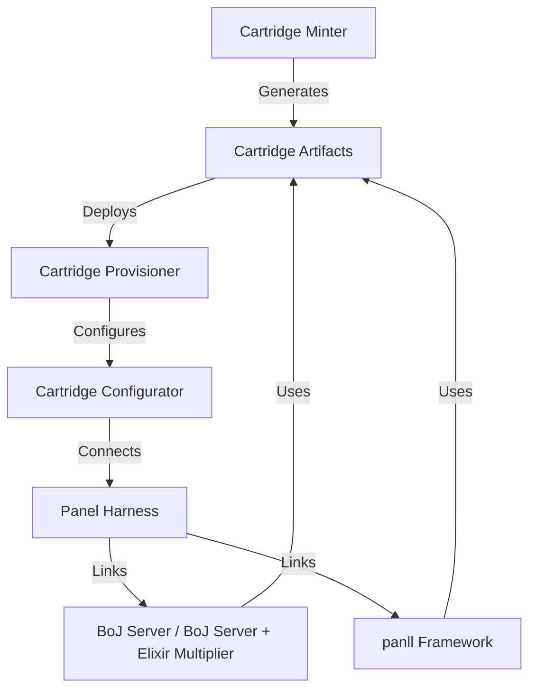
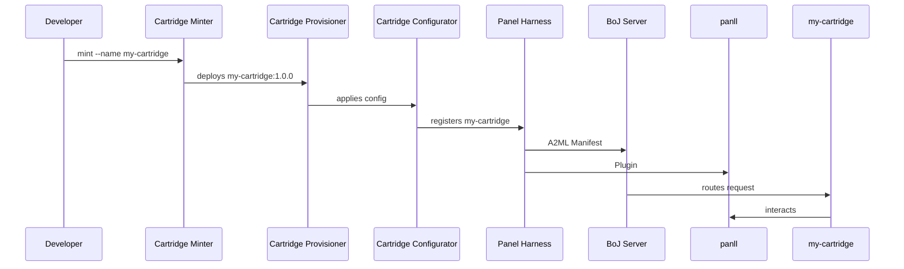

<!--
SPDX-License-Identifier: MPL-2.0
Copyright (c) Jonathan D.A. Jewell <j.d.a.jewell@open.ac.uk>
-->
# Cartridge Tools Specification

**Powerful Cartridge Minter, Provisioner, Configurator, and Panel Harness**

For BoJ Server, BoJ Server + Elixir Multiplier, and panll Integration

> For the cartridge specification itself (what a cartridge IS — the 2D matrix, lifecycle, HAT model, manifest schema, and ephemerality model), see [../cartridges/README.md](../cartridges/README.md).

## 1. Core Philosophy & Design Tenets

### Purpose

- **Empower Global Collaboration**: Make it trivial for anyone to create, provision, configure, and connect cartridges to the BoJ Server ecosystem and panll.
- **Self-Service**: Users should be able to mint, deploy, and manage cartridges without deep technical knowledge.
- **Security & Trust**: Ensure authentication, authorization, and data integrity for all operations.
- **Scalability**: Support Amazon/Whatsapp-scale deployments, with parallelism, fault tolerance, and observability.
- **Versatility**: Work with BoJ Server, BoJ Server + Elixir Multiplier, and panll, both locally and in distributed environments.

### Target Users

- **Cartridge Developers**: Need tools to package, test, and distribute their cartridges.
- **System Administrators**: Require provisioning, configuration, and monitoring tools.
- **End Users**: Should be able to discover, install, and use cartridges with minimal friction.
- **AI Agents**: Must be able to interact programmatically with the tooling via APIs.

## 2. Architecture Overview

### 2.1. High-Level Component Map



### 2.2. Component Responsibilities

| Component | Responsibility | Key Technologies |
|-----------|----------------|------------------|
| Cartridge Minter | Package, sign, and version cartridges | Docker, OCI, Sigstore, :mix for Elixir |
| Cartridge Provisioner | Deploy cartridges to servers/nodes | Terraform, Kubernetes, :libcluster, OTP |
| Cartridge Configurator | Apply runtime configuration to cartridges | JSON/YAML, :confex, :libcluster |
| Panel Harness | Bridge cartridges to BoJ Server/panll | A2ML Manifests, Phoenix Channels, gRPC |

## 3. Detailed Component Specifications

### 3.1. Cartridge Minter

**Goal**: Make it easy to create, sign, and distribute cartridges that work with BoJ Server and panll.

#### Functional Requirements

| ID | Requirement | Description | Cross-References |
|----|-------------|-------------|------------------|
| CM-001 | Cartridge Packaging | Bundle code, config, and metadata into a distributable artifact | Docker, OCI, :mix archive |
| CM-002 | Versioning & Signing | Assign semantic versions and cryptographic signatures to cartridges | SemVer, Sigstore, :mix hex |
| CM-003 | Dependency Management | Resolve and bundle runtime dependencies | :mix deps, Docker multi-stage builds |
| CM-004 | Metadata Generation | Auto-generate A2ML Manifests and panll descriptors | JSON Schema, :jason |
| CM-005 | Local & Remote Registry | Publish to local cache or a global registry (e.g., GitHub Container Registry) | OCI, :mix hex |
| CM-006 | CLI & API | Provide a CLI (cartridge mint) and REST/gRPC API | escript, Absinthe/GraphQL |

#### Non-Functional Requirements

| ID | Requirement | Description | Cross-References |
|----|-------------|-------------|------------------|
| CM-NFR-001 | Reproducibility | Same input → same output every time | Docker layers, deterministic builds |
| CM-NFR-002 | Security | Cartridges are signed and verified before deployment | Sigstore, :mix hex signatures |
| CM-NFR-003 | Performance | Minting should be fast (<10s for most cartridges) | Parallel dependency resolution, caching |
| CM-NFR-004 | Extensibility | Support custom packagers (e.g., Nix, Bazel) | Plugin architecture |

#### Example Workflow

1. Developer writes a cartridge (e.g., a Python AI model wrapper)
2. Runs: `cartridge mint --name my-ai-cartridge --version 1.0.0 --sign`
3. Output:
   - `my-ai-cartridge:1.0.0.sigstore` (signed OCI image)
   - `my-ai-cartridge.a2ml.json` (A2ML Manifest)
   - `my-ai-cartridge.panll.json` (panll descriptor)

#### CLI/API Design

```bash
# CLI
cartridge mint --name my-cartridge --language elixir --type ai-agent
cartridge publish --registry ghcr.io/myorg --sign

# API (GraphQL example)
mutation {
  mintCartridge(
    input: {
      name: "my-cartridge"
      language: "elixir"
      dependencies: ["libcluster", "telemetry"]
      sign: true
    }
  ) {
    artifactId
    signature
    manifest {
      a2ml
      panll
    }
  }
}
```

### 3.2. Cartridge Provisioner

**Goal**: Deploy cartridges to BoJ Server, BoJ Server + Elixir Multiplier, or panll with zero downtime.

#### Functional Requirements

| ID | Requirement | Description | Cross-References |
|----|-------------|-------------|------------------|
| CP-001 | Multi-Target Deployment | Deploy to BoJ Server, BoJ Server + Multiplier, or panll | :libcluster, Kubernetes, Terraform |
| CP-002 | Auto-Scaling | Scale cartridges based on load | :telemetry, Prometheus |
| CP-003 | Health Checks | Monitor cartridge health and restart failed instances | :fuse, /health endpoints |
| CP-004 | Rollback & Recovery | Revert to previous versions on failure | Git-style versioning, checkpoints |
| CP-005 | Secret Management | Inject secrets securely (e.g., API keys, DB credentials) | Vault, Kubernetes Secrets |
| CP-006 | CLI & API | Provide a CLI (cartridge deploy) and REST/gRPC API | kubectl-like UX, Absinthe |

#### Non-Functional Requirements

| ID | Requirement | Description | Cross-References |
|----|-------------|-------------|------------------|
| CP-NFR-001 | Fault Tolerance | Survive node failures without data loss | Supervisors, :libcluster |
| CP-NFR-002 | Performance | Deploy <30s for most cartridges | Parallel node provisioning |
| CP-NFR-003 | Security | Only authorized users can deploy cartridges | RBAC, JWT |
| CP-NFR-004 | Observability | Log all provisioning events and cartridge metrics | :telemetry, Prometheus |

#### Example Workflow

1. User runs: `cartridge deploy --target boj-server --cartridge my-ai-cartridge:1.0.0`
2. Provisioner:
   - Pulls the cartridge from the registry
   - Configures the node (BoJ Server or panll)
   - Starts the cartridge with health checks
   - Publishes metrics to :telemetry

#### CLI/API Design

```bash
# CLI
cartridge deploy --target boj-server --cartridge my-cartridge:1.0.0 --scale 3
cartridge status --cartridge my-cartridge

# API (GraphQL example)
mutation {
  deployCartridge(
    input: {
      target: "boj-server"
      cartridgeId: "my-cartridge:1.0.0"
      config: { env: { API_KEY: "***secret***" } }
      scale: 3
    }
  ) {
    instanceId
    status
    healthCheck {
      status
      latency
    }
  }
}
```

### 3.3. Cartridge Configurator

**Goal**: Apply runtime configuration to cartridges dynamically, without redeployment.

#### Functional Requirements

| ID | Requirement | Description | Cross-References |
|----|-------------|-------------|------------------|
| CC-001 | Dynamic Config | Update cartridge settings (e.g., API endpoints, rate limits) without restart | :confex, :libcluster |
| CC-002 | Multi-Environment | Support dev/staging/prod configurations | JSON/YAML, :mix env |
| CC-003 | Validation | Reject invalid configurations | JSON Schema, :jason |
| CC-004 | Secret Injection | Replace placeholders (e.g., `{{API_KEY}}`) with secrets | Vault, Kubernetes Secrets |
| CC-005 | CLI & API | Provide a CLI (cartridge config) and REST/gRPC API | kubectl configmap, Absinthe |

#### Non-Functional Requirements

| ID | Requirement | Description | Cross-References |
|----|-------------|-------------|------------------|
| CC-NFR-001 | Atomicity | Config changes are applied transactionally | :gen_statem, distributed locks |
| CC-NFR-002 | Consistency | All nodes see the same config | :libcluster, CRDTs |
| CC-NFR-003 | Performance | Apply config changes in <100ms | In-memory config, caching |

#### Example Workflow

1. User updates a config file:
   ```yaml
   # config/prod.yaml
   api_endpoint: "https://api.example.com"
   rate_limit: 1000
   ```
2. Runs: `cartridge config apply --cartridge my-cartridge --file config/prod.yaml`
3. Configurator:
   - Validates the config
   - Pushes it to all nodes running my-cartridge
   - Triggers a hot-reload if supported

#### CLI/API Design

```bash
# CLI
cartridge config apply --cartridge my-cartridge --file prod.yaml
cartridge config get --cartridge my-cartridge

# API (GraphQL example)
mutation {
  applyConfig(
    input: {
      cartridgeId: "my-cartridge"
      config: { api_endpoint: "https://api.example.com", rate_limit: 1000 }
    }
  ) {
    success
    errors
  }
}
```

### 3.4. Panel Harness

**Goal**: Bridge cartridges to BoJ Server and panll, enabling seamless interaction.

#### Functional Requirements

| ID | Requirement | Description | Cross-References |
|----|-------------|-------------|------------------|
| PH-001 | BoJ Server Integration | Register cartridges as A2ML-compliant services | A2ML Manifests, :gen_server |
| PH-002 | panll Integration | Expose cartridges as panll modules | panll's plugin system |
| PH-003 | Protocol Translation | Convert between cartridge formats (e.g., REST ↔ gRPC ↔ GraphQL) | zig Triple Adapter, Phoenix Channels |
| PH-004 | Event Routing | Route events between cartridges and BoJ Server/panll | Phoenix PubSub, A2ML Events |
| PH-005 | CLI & API | Provide a CLI (panel harness) and REST/gRPC API | escript, Absinthe |

#### Non-Functional Requirements

| ID | Requirement | Description | Cross-References |
|----|-------------|-------------|------------------|
| PH-NFR-001 | Low Latency | Sub-100ms event routing | Phoenix Channels, WebSockets |
| PH-NFR-002 | Scalability | Handle 1M+ concurrent connections | :libcluster, :ranch |
| PH-NFR-003 | Security | Authenticate all panel ↔ cartridge ↔ BoJ/panll traffic | JWT, TLS 1.3 |
| PH-NFR-004 | Observability | Log all panel interactions | :telemetry, Jaeger |

#### Example Workflow

1. Cartridge my-ai-cartridge is deployed
2. Panel Harness:
   - Registers it as an A2ML service in BoJ Server
   - Exposes it as a panll module
   - Routes events between my-ai-cartridge and BoJ/panll

#### CLI/API Design

```bash
# CLI
panel harness register --cartridge my-ai-cartridge --as a2ml-service
panel harness expose --cartridge my-ai-cartridge --to panll

# API (GraphQL example)
mutation {
  registerCartridge(
    input: {
      cartridgeId: "my-ai-cartridge"
      as: "a2ml-service"
      routes: [
        { protocol: "REST", port: 4000 },
        { protocol: "gRPC", port: 50051 }
      ]
    }
  ) {
    serviceId
    endpoints
  }
}
```

## 4. Cross-Component Integration

### 4.1. Data Flow



### 4.2. Shared State & Configuration

- **Cartridge Registry**: Central store of all cartridges (local + remote)
  - Implemented as a Mnesia/Riak cluster or PostgreSQL logical replication
- **Configuration Store**: Versioned config for each cartridge
  - Stored in Git (for dev) or Vault (for prod)
- **Authentication Service**: Manages JWT/OAuth2 tokens for all components
  - Implemented as a Phoenix app or Elixir OTP app

## 5. Security Model

| Threat | Mitigation | Cross-References |
|--------|------------|------------------|
| Unauthorized cartridge deployment | RBAC + JWT | :rules, Absinthe middleware |
| Cartridge tampering | Sigstore signatures | :mix hex signatures, Sigstore |
| Secret leakage | Vault integration | :libcluster node encryption, Vault |
| Panel spoofing | Mutual TLS | TLS 1.3, :ssl |
| Data corruption | Checksums + versioning | Git-style hashes, :mix archive |

## 6. Performance Targets

| Metric | Target | Notes |
|--------|--------|-------|
| Cartridge minting | <10s | Parallel dependency resolution |
| Cartridge deployment | <30s | Parallel node provisioning |
| Config apply | <100ms | In-memory config, caching |
| Event routing | <50ms | Phoenix Channels, WebSockets |
| Scalability | 1M+ concurrent connections | :libcluster, :ranch |

## 7. Implementation Guidance

### 7.1. Tech Stack Recommendations

| Component | Recommended Tech | Alternatives |
|-----------|------------------|--------------|
| Cartridge Minter | Elixir (:mix), Docker, OCI | Nix, Bazel |
| Cartridge Provisioner | Elixir (:libcluster, :telemetry), Kubernetes | Terraform, Nomad |
| Cartridge Configurator | Elixir (:confex, :libcluster) | Consul, etcd |
| Panel Harness | Phoenix Channels, Absinthe | gRPC, HTTP/2 |

### 7.2. Boilerplate Code

#### Cartridge Minter (Elixir)

```elixir
# lib/cartridge_minter.ex
defmodule CartridgeMinter do
  @moduledoc """
  Mints cartridges from code and config.
  """

  def mint(%{name: name, language: lang, dependencies: deps} = attrs) do
    # 1. Package as Docker/OCI image
    # 2. Generate A2ML Manifest
    # 3. Sign the cartridge
    # 4. Return artifact ID and signature
  end
end
```

#### Cartridge Provisioner (Elixir)

```elixir
# lib/cartridge_provisioner.ex
defmodule CartridgeProvisioner do
  @moduledoc """
  Deploys cartridges to nodes.
  """

  def deploy(target, cartridge_id, scale: scale) do
    # 1. Pull cartridge from registry
    # 2. Configure node (BoJ Server or `panll`)
    # 3. Start cartridge with health checks
    # 4. Scale to `scale` instances
  end
end
```

#### Panel Harness (Phoenix)

```elixir
# lib/panel_harness_web/router.ex
scope "/api", PanelHarnessWeb do
  post "/register", CartridgeController, :register
  post "/expose", CartridgeController, :expose_to_panll
end
```

## 8. Validation & Testing

- **Unit Tests**: Test each component in isolation (e.g., config validation, signature verification)
- **Integration Tests**: Deploy a test cartridge and verify end-to-end flow
- **Chaos Engineering**: Kill nodes, simulate network partitions, and verify recovery
- **Load Testing**: Use benchee or custom scripts to test scalability
- **Security Audits**: Regularly scan for vulnerabilities (e.g., :sobelow, mix_audit)

## 9. Documentation & Onboarding

- **Quickstart Guides**:
  - "Mint Your First Cartridge"
  - "Deploy Cartridges to BoJ Server"
  - "Configure Cartridges Dynamically"
  - "Connect Cartridges to panll"
- **Architecture Diagrams**: Use Mermaid/PlantUML to visualize data flow
- **API Reference**: Auto-generated from OpenAPI/Swagger
- **Example Cartridges**: Provide minimal cartridges for Elixir, Python, and Rust

## 10. Open Questions & Further Research

- How should multi-language cartridges (e.g., Python + Elixir) be handled?
- What's the best way to version A2ML Manifests alongside cartridges?
- Should the Panel Harness support WebAssembly (Wasm) for cartridges?
- How to audit cartridge usage for billing/metering?

## 11. Next Steps

1. Prototype the Cartridge Minter: Start with Docker + OCI packaging
2. Build the Provisioner: Integrate with BoJ Server's :libcluster
3. Design the Panel Harness: Focus on A2ML/panll integration
4. Implement the Configurator: Use :confex for dynamic config
5. Test End-to-End: Deploy a test cartridge and verify all components
6. Document & Publish: Add guides and examples to the repo

Use this spec as a living document. Iterate based on feedback, new requirements, or technological advancements.